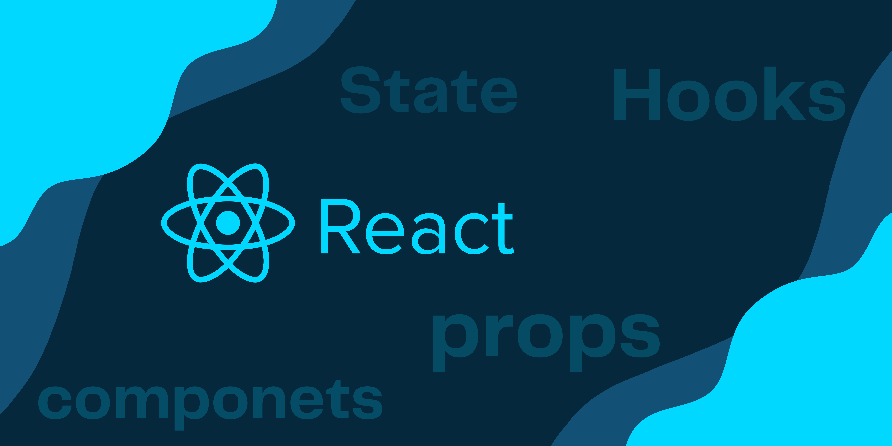

# React Practise projects

# Welcome to my GitHub repository of React projects! 

## Introduction

In this repository, you will find a collection of projects that I have built using ``React``, a popular JavaScript library for creating user interfaces. 

React is a powerful tool that allows me to create dynamic and interactive web applications with ease.

## What is contained

 These projects are meant to ``showcase my skills and passion`` for React development. I have learned a lot from building these projects and I hope you will enjoy exploring them as well. 

I am always open to learning new things and improving my code quality. 

## Conclusion

If you have any feedback or suggestions for me, please feel free to contact me or open an issue on GitHub. Thank you for visiting my repository and ``happy coding!``
