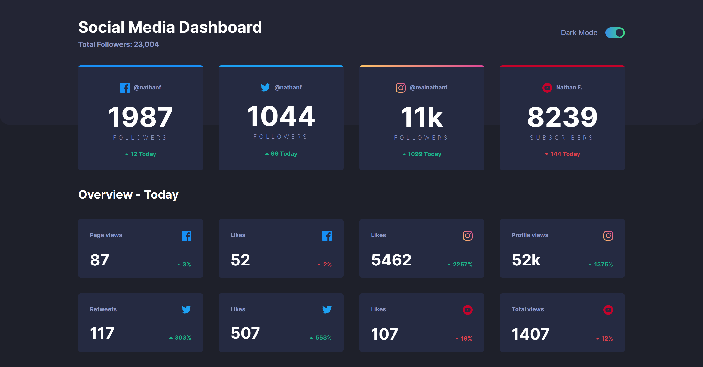
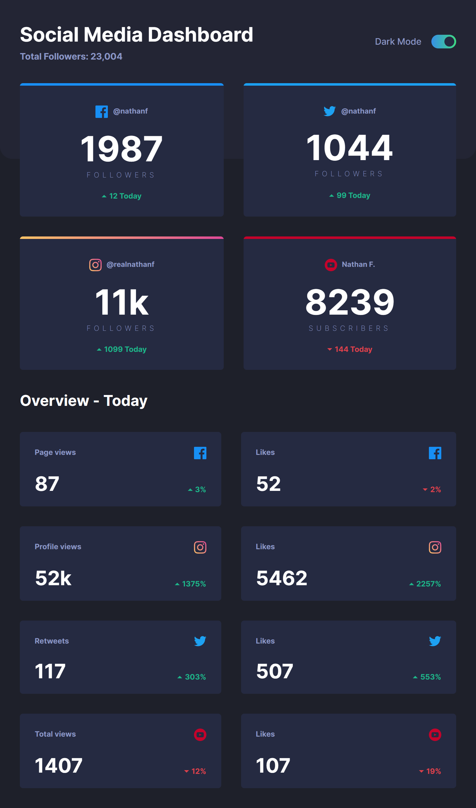
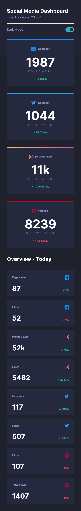

# Frontend Mentor - Social media dashboard with theme switcher solution

This is a solution to the [Social media dashboard with theme switcher challenge on Frontend Mentor](https://www.frontendmentor.io/challenges/social-media-dashboard-with-theme-switcher-6oY8ozp_H). Frontend Mentor challenges help you improve your coding skills by building realistic projects. 

## Table of contents

- [Overview](#overview)
  - [The challenge](#the-challenge)
  - [Screenshot](#screenshot)
  - [Links](#links)
- [My process](#my-process)
  - [Built with](#built-with)
  - [What I learned](#what-i-learned)
  - [Continued development](#continued-development)
  - [Useful resources](#useful-resources)
- [Author](#author)

## Overview

Thos challenge forced me to learn a lot of new concepts to get it to work. I enjoyed building it with ``CSS Grid`` since I'm now getting more comfortable using it. The layout would have been very difficult to do with ``Flexbox``

### The challenge

Users should be able to:

- View the optimal layout for the site depending on their device's screen size
- See hover states for all interactive elements on the page
- Toggle color theme to their preference

### Screenshot

### Desktop View

### Tablet View

### Mobile View

### Links

- Frontend Mentor - [@dxiDavid](https://www.frontendmentor.io/profile/dxiDavid)
- Live Site URL: [Go Live](https://react-socialmedia-dasboard.vercel.app/)

## My process

I started by identifying any reusable components, made a data file then mapped that data to those components. The components were all in the parent component as ``JSX`` elements first to make sure everything rendered correctly then I moved each component to a separate file and passed the ``.map()`` function parameters as props.
 
 
After The styling was done, I added the dark mode toggle functionaliy and some animations to make it more interesting

### Built with

- Semantic HTML5 markup
- CSS custom properties
- Flexbox
- CSS Grid
- Mobile-first workflow
- [React](https://reactjs.org/) - JS library

### What I learned

1. I learned how to use ``grid-template-areas`` to move elements around the page

2. I learned how to use CSS custom properties to add the dark mode feature to the page

3. I learned about the context API though I didn't use it since this was a simple project

### Continued development

I don't quite know what else to do. Maybe comeback and optimize the code?

### Useful resources

- [Youtube](https://www.youtube.com/@KevinPowell) - This is where I found the best tutorials and explanations (For me) on CSS concepts and      writing functional CSS. Kevin Powel really knows his stuff and gives concise explanations.
- [w3schools](https://w3schools.com) - This website has an entire course on JavaScript with simple examples for both basic and advanced concepts.
- [CSS Tricks](https://css-tricks.com/) - This website provides very well written explanations to CSS concepts as well as examples for when you need to revisit a concept.
- [mdn](https://developer.mozilla.org/en-US/) - Always helpful to read the documentation of any language.

- THE REACT DOCS

## Author

- Frontend Mentor - [@dxiDavid](https://www.frontendmentor.io/profile/dxiDavid)
- Twitter - [@dxidavid254](https://www.twitter.com/dxidavid254)
